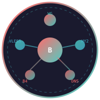

<p align="center">
  
</p>

<h1 align="center">BalanSir</h1>

<p align="center">
  <a href="README.md">English</a>
</p>

<p align="center">
  <strong>Движок сетевых политик для Linux-роутеров и шлюзов</strong>
</p>

<p align="center">
  <a href="#что-такое-balansir">Что такое BalanSir</a> •
  <a href="#архитектура">Архитектура</a> •
  <a href="#компоненты">Компоненты</a> •
  <a href="#быстрый-старт">Быстрый старт</a> •
  <a href="#конфигурация">Конфигурация</a> •
  <a href="#сборка">Сборка</a> •
  <a href="#тестирование">Тестирование</a> •
  <a href="#документация">Документация</a>
</p>

<p align="center">
  
  
  
  
</p>

---

## Что такое BalanSir

BalanSir — это **движок сетевых политик** на Rust для Linux-роутеров, шлюзов и
встраиваемых устройств. Он применяет декларативные правила к трафику, управляет
транспортными драйверами (VPN/прокси) и предоставляет единый API управления и WebUI.

Это **не VPN-клиент**. Это слой, который решает, *какой* трафик *куда* и *как*
направляется, и приводит транспорт и состояние ядра (nftables/netlink) к желаемому
состоянию через пару процессов с разделением привилегий (daemon + executor).

> Статус: **alpha**. Проект активно развивается; этот README описывает текущую
> ветку `main`. Некоторые компоненты реализованы глубже других — см. статус ниже.

### Зачем BalanSir

| Проблема | Что делает BalanSir сегодня |
|----------|------------------------------|
| Много разных конфигов VPN/прокси | Единый транспортный слой с драйверами по протоколам |
| Выбор VPN-профиля | `VpnPool`: взвешенный выбор профиля на основе health-пробирования |
| Смерть локального рантайма | (Запланировано) L2 lifecycle watchdog по ADR-033 — пока не в `main` |
| Нет видимости решений | Decision trace, снапшот `/subsystems`, метрики Prometheus |
| Разделение привилегий | Непривилегированный daemon + root executor через авторизованный IPC |

---

## Архитектура

```
┌────────────────────────────────────────────────────────────────┐
│                    balansir-daemon (непривилегированный)       │
│                                                                │
│  PolicyEngine (правила → ActionRequest)  VpnPool (L1)          │
│       │                                            │           │
│       ▼                                            ▼           │
│  Coordinator/Reconciler ──── XrayManager ──── B4/DPI engine    │
│       │                           │              │             │
│  IPC (postcard + SO_PEERCRED)     │              │             │
└───────┼───────────────────────────┼──────────────┼─────────────┘
        ▼                           ▼              ▼
┌────────────────────────────────────────────────────────────────┐
│               balansir-executor (root, минимальный)            │
│     nftables / ip-rule / netlink / interface / QoS / path-MTU  │
└────────────────────────────────────────────────────────────────┘
```

Проект следует принципу **Policy → Mechanism**: драйверы и executor выполняют
механизм (nftables, состояние ядра, процессы), а движок политик и control plane
принимают решения. Два процесса общаются по аутентифицированному бинарному IPC
(framing postcard + проверка `SO_PEERCRED`, ADR-005/ADR-004/ADR-011).

---

## Компоненты

### Движок политик

Декларативный движок правил. Правила желаемого состояния (`config/balansir.toml`,
`[[rules]]`) компилируются в нейтральные `ActionRequest` и применяются через
executor (nftables/netlink) циклом реконсиляции. Отдельный matcher-based
`PolicyEngine` (matchers по домену/IP/порту/протоколу) с decision trace также
существует и используется в стресс-тестах; в runtime-путь демона он пока не встроен.

- Действия правил из конфига (`[[rules]]`): `allow`, `block`, `reject`, `log`.
  Более широкий enum `Action` (route/mark/forward/shape/queue) существует на границе
  executor, но пока не достижим из TOML-конфига.
- Health-зависимый fallback (`rule.fallback`) реализован только в автономном
  движке и пока не доступен из TOML-конфига.
- **Нет** matchers по GeoIP или задержке.

### VPN

Управление VPN-профилями: `balansir-vpn` + `vpn_manager.rs` в демоне.

- **Profile probe** → **TCP connect probe** → **PathSample** → **PathHealth** → **VpnPool**.
- `TcpConnectProbe` — ограниченная по времени проверка TCP-достижимости `server:port`
  (безопасно с IPv6). Результат питает `PathHealth` (EMA-сглаживание задержки,
  гистерезис, анти-flap cooldown) — это сигнал **L1**.
- `VpnPool` выполняет взвешенный выбор профиля (health-вес + бонус доступности −
  штрафы за задержку/нагрузку), минимальное время удержания (dwell, по умолчанию
  120 с) и циклит профили через
  `Healthy → Degraded → Failed → Cooldown → Recovering → Healthy`.
  Когда не остаётся ни одного подходящего профиля, активный профиль сбрасывается
  (трафик идёт напрямую).
- Выбранный профиль передаётся в `XrayManager` через pool consumer
  (`apply_pool_profile`); пул авторитетен для выбора.

### Xray / health L2

`XrayManager` запускает активный Xray-драйвер (VLESS/Reality), следит за ним через
`driver.health_check()` и управляет per-endpoint `PathHealth` failover для статичных
endpoint'ов.

**Модель health (ADR-033)**:

- **L1** — удалённая TCP-достижимость `server:port`. Per-profile. Влияет на выбор.
- **L2** — локальная живость активного драйвера (`kill(pid,0)` + приём на локальном
  SOCKS-входе). Влияет на жизненный цикл.
- **L3** — реальный запрос внутри туннеля. Не реализовано.

> **L2 запланирован, но пока не в `main`.** ADR-033 определяет ограниченный
> watchdog перезапуска/восстановления во владении `XrayManager`, но реализация
> находится на отдельной ветке и **не** влита. На `main` pool-driven путь опирается
> на выбор по L1 и на `health_check` драйвера; автоматической защиты от смерти
> локального рантайма пока нет.

### B4 / DPI

- **B4** (`balansir-b4` + `b4_engine` в демоне): NFQUEUE-движок на чистом Rust
  (netlink-sys, без libnetfilter-queue) с классификацией потоков, пакетными
  стратегиями (MSS/StripSack/TTL) и catch-all fallback профиля. Это
  контролируемый политикой *адаптационный* слой (решает *как* доставить поток),
  никогда не является источником политики. Включается через `BALANSIR_B4_CONFIG`.
- **DPI-менеджер** (`b4_dpi.rs`): ставит/снимает правила очереди nftables через
  executor, обнаруживает смерть движка и при остановке возвращает трафик на
  прямой путь (без blackhole). Включается через `BALANSIR_DPI_CONFIG`.

### Драйверы

| Драйвер | Статус | Примечания |
|---------|--------|------------|
| **Xray** (VLESS/Reality) | Реализован | Настоящий драйвер; SOCKS/HTTP inbound, `health_check` (pid + локальный приём) |
| **B4** | Реализован | NFQUEUE-движок + DPI-менеджер |
| **DNS forwarder** | Реализован | SOCKS5 UDP-relay, кэш, DNS registry |
| **UPnP** | Реализован | SSDP-обнаружение + SOAP port mapping |
| **Hysteria 2** | Реализован | Конфиг и драйвер присутствуют |
| **Tailscale** | Экспериментальный | Свободные функции поверх `tailscale`; не `ComponentDriver` |
| **WireGuard** | Частично | Поднятие интерфейса/адрес, но нет `wg setconf` (ключи/пиры не применяются) |
| **AmneziaWG** | Частично | Аналогично WireGuard; за feature-флагом |

По умолчанию включены: `wireguard`, `xray`, `hysteria`, `b4`, `dns` (feature-флаги Cargo).

### Executor / daemon

- `balansir-daemon`: непривилегированный процесс, tokio runtime `current_thread`,
  владеет циклом политики/реконсиляции, драйверами, VPN-пулом, DNS, B4/DPI, Xray,
  API-сервером и общим снапшотом подсистем. Конфиг запуска — `BALANSIR_CONFIG`
  (некорректный конфиг = фатальный выход; без конфига = старт пустым, ADR-027).
- `balansir-executor`: минимальный root-процесс, отказывается запускаться, если
  `euid != 0`, применяет изменения nftables/ip-rule/interface/QoS/path-MTU и
  проверяет пиров по IPC (`SO_PEERCRED`, GID `1500`).

### API

HTTP-сервер на Axum (`balansir-api`) с REST + SSE:

- Health: `/health`, `/ready`, `/live`, `/version`, `/build-info`
- Состояние: `/desired`, `/actual`, `/state`, `/drift`, `/subsystems`, `/system`
- Управление: `/reconcile`, `/reload`, `/drivers`, `/drivers/:id/restart`
- VPN: `/vpn/pool`, `/vpn/pause`, `/vpn/refresh`, `/vpn/rotate`, `/vpn/pin`
- Xray: `/xray`, `/xray/pause`, `/xray/select`, `/xray/rotate`
- B4/DPI: `/b4`, `/b4/pause`, `/dpi`
- Пути: `/path/decision`; QoS: `/qos`; Интерфейсы: `/interfaces`
- События: `/events/stream` (SSE); Метрики: `/metrics` (Prometheus)

### OTA

`balansir-ota` предоставляет обновления с A/B-слотами (mmcblk0p2/p3, смена загрузки
через `cmdline.txt`), манифесты с подписью Ed25519 и ротацией ключей,
подтверждение загрузки и откат. `tools/balansir-image` собирает/инспектирует/
проверяет образы прошивок.

### WebUI

Svelte-дашборд (`webui/`), который рендерит то же состояние `PathHealth`/подсистем,
которым пользуются менеджеры, — UI не может разойтись с решениями рантайма.

---

## Быстрый старт

### Сборка из исходников

```bash
git clone https://github.com/Egorich-print/BalanSir.git
cd BalanSir

# Релизная сборка
make build

# Тесты
make test

# Отладочная сборка
make dev
```

### Установка (Linux, нужен root)

```bash
sudo make install
```

Устанавливает `balansir-daemon`, `balansir-executor` и `balansir-cli`, пример
конфига и systemd-юниты.

```bash
# Конфигурация
sudo nano /etc/balansir/balansir.toml

# Запуск
sudo systemctl start balansir-executor
sudo systemctl start balansir-daemon
```

### Проверка

```bash
# CLI (нужен запущенный сокет демона)
balansir-cli status
balansir-cli explain

# REST API
curl http://127.0.0.1:8080/health
curl http://127.0.0.1:8080/subsystems
```

> Команды `balansir-cli`: `status`, `plan`, `explain`, `desired`, `actual`,
> `fingerprint`, `reload <config.toml>`.

### Docker

В репозитории есть многоступенчатый `Dockerfile` и `docker-compose.yml`. Образ
собирается из этого репозитория (в публичный registry не публикуется):

```bash
docker compose up -d
```

---

## Конфигурация

BalanSir настраивается через переменные окружения и TOML-файлы. Демон загружает
политику желаемого состояния из `BALANSIR_CONFIG` (пример: `config/balansir.toml`);
остальные компоненты включаются своими переменными (`BALANSIR_B4_CONFIG`,
`BALANSIR_DPI_CONFIG`, `BALANSIR_XRAY_CONFIG`, `BALANSIR_VPN_CONFIG`,
`BALANSIR_DNS_CONFIG`). API-сервер слушает по `BALANSIR_API_BIND`.

### Правила политики (`BALANSIR_CONFIG`)

```toml
[policy]
# "pass" (fail-open, по умолчанию) или "drop" (fail-closed: один терминальный drop)
empty_config_action = "pass"

[[rules]]
id = 1
action = "block"
priority = 100

# Flow-матчеры опциональны (src/dst IP, dst port, protocol, domain):
# [[rules]]
# id = 2
# action = "allow"
# priority = 90
# dst_domain = "example.com"
# dst_port = 443
# protocol = "tcp"

[[drivers]]
id = "dns"
action = "start"
```

### Профили железа

Профили устройств лежат в `config/profiles/` (`milkv-duos`, `x86`, `fornex-weeb`).
Они задают тип рантайма, лимиты памяти, включённые драйверы, бюджеты firewall и
политику OTA-слотов. Образ для Raspberry Pi 3B собирается из
`buildroot-external/configs/balansir_rpi3b_64_defconfig`.

---

## Сборка

### Требования

- Rust toolchain (stable)
- Для кросс-компиляции — соответствующий кросс-C тулчейн (см. `.cargo/config.toml`;
  линкеры настроены по целям)

### Команды

```bash
make dev       # отладочная сборка
make build     # релизная сборка
make test      # запуск тестов
make check     # cargo check + clippy
make install   # системная установка (Linux)
make uninstall
```

### Цели кросс-компиляции

CI кросс-собирает `x86_64-unknown-linux-gnu`, `aarch64-unknown-linux-gnu` и
`riscv64gc-unknown-linux-musl`. Это **цели сборки в CI** — они не означают
тестирования на реальном железе. На реальном железе обкатан только Raspberry Pi 3B
(образ buildroot + gateway E2E harness).

---

## Тестирование

```bash
cargo test --workspace --no-fail-fast
```

Базовый `main`: **475 тестов проходят, 0 падает, 4 игнорируются** (netns-тесты,
требующие root). Root-тесты netns:

```bash
sudo cargo test -p balansir-tests -- --ignored
```

Покрытие: юнит-тесты, gateway E2E harness (`tests/gateway_e2e.sh`, запускается на
Pi), IPC-интеграционные тесты, стресс-тесты.

---

## Документация

- [Аудит архитектуры](ARCHITECTURE_AUDIT.md)
- [Технический долг](TECH_DEBT.md)
- [Дорожная карта](ROADMAP.md)
- [Состояние проекта](PROJECT_STATE.md)
- [Операционный статус](STATUS.md)
- [Architecture Decision Records](docs/adr/) — ADR-000 … ADR-033
  (важные: [ADR-005 разделение привилегий](docs/adr/ADR-005-privilege-separation.md),
  [ADR-027 конфиг запуска](docs/adr/ADR-027-startup-config-recovery.md),
  [ADR-033 модель двухуровневого health](docs/adr/ADR-033-two-level-health-model.md))

---

## Лицензия

Лицензировано по одному из:

- Apache License, Version 2.0
- MIT License ([LICENSE-MIT](LICENSE-MIT))

по вашему выбору.